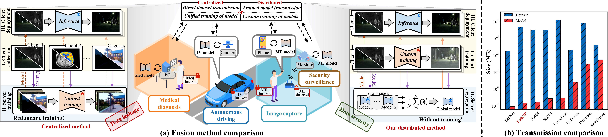

# FedMIF: Fast-Generalization Image Fusion via Task-Customized Nodes Federated Learning

🧠 FedMIF is the **first distributed image fusion framework**, designed to fuse multi-modal images in a privacy-preserving and communication-efficient manner using federated learning.



---

## 📁 Project Structure

```
FedMIF/
│
├── src/                          # Source code
│   ├── FedFusion_main.py         # Main training script
│   ├── FedFusion_test.py         # Inference / testing script
│   ├── options.py                # Argument parser and config
│   ├── data/Dataloader.py        # Datasets and dataloaders

```

---

## 🚀 Features

- ✅ **Federated Learning**: No need to centralize sensitive multi-modal data.
- ✅ **Task-Customized Nodes**: Task specific training for different tasks.
- ✅ **Communication Efficiency**: Much lower overhead than directly transmitting raw data.
---

## 🏁 Getting Started

### 1. Install dependencies

```bash
pip install -r requirements.txt
```
---

### 2. Train the model

```bash
cd src
python FedFusion_main.py
```

**Optional arguments** (defined in `options.py`):

- `--epochs`: number of global training rounds
- `--num_users`: number of clients

---

### 3. Test the model

```bash
cd src
python FedFusion_test.py
```

> The results will be saved in the directory specified in the test script.

---

## 🗂️ Supported Datasets

- Infrared & Visible (IV)
- Medical (PET & MRI)
- Multi-Focus Images
- Multi-Exposure Images

---

## 📬 Contact

For questions or feedback, feel free to open an issue or contact:

📧 suwj@mail.dlut.edu.cn

---

## 📄 License

This project is licensed under the MIT License.
